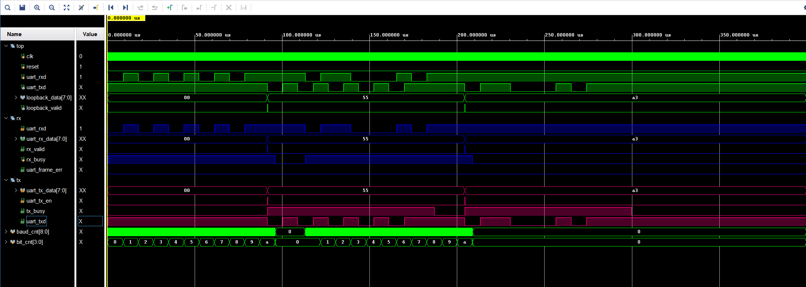

# Parameterized UART IP Core

A lightweight UART transmitter and receiver written in Verilog.

The main feature of this project is its **parameterized configuration**.  
The UART communication format can be changed directly through module parameters without modifying the internal TX/RX logic.

## Features

The following parameters can be configured:

| Parameter | Description |
|---|---|
| `CLK_FREQ` | FPGA system clock frequency |
| `BAUD_RATE` | UART baud rate |
| `DATA_WIDTH` | Number of data bits |
| `STOP_WIDTH` | Number of stop bits |
| `CHECK_TYPE` | Parity mode: None / Odd / Even |

With different parameter settings, the same RTL design can support UART formats such as:

```text
8N1
8O1
8E1
7E2
...
```

The key idea is that the UART frame format and baud-rate timing can be changed only by modifying parameters, while the TX/RX logic remains unchanged.

## Configuration Example

Example configuration:

- Clock: 50 MHz
- Baud rate: 115200
- Data bits: 8
- Parity: Odd
- Stop bits: 1

```verilog
uart_top #(
    .CLK_FREQ   (50_000_000),
    .BAUD_RATE  (115200),
    .DATA_WIDTH (8),
    .STOP_WIDTH (1),
    .CHECK_TYPE (1)
) u_uart (
    .clk      (clk),
    .reset    (reset),
    .uart_rxd (uart_rxd),
    .uart_txd (uart_txd)
);
```

For example, changing:

```verilog
.CHECK_TYPE(1)
```

to:

```verilog
.CHECK_TYPE(0)
```

changes the UART format from **8O1** to **8N1**.

## Simulation

The testbench uses a UART loopback structure:

```text
UART_RX → Received Data → UART_TX
```

The test data includes:

```text
0x55
0xA3
```

The received data is decoded by the RX module and then transmitted again through the TX module.

### Simulation Waveform



---

# 可参数化 UART IP 核

这是一个使用 Verilog 实现的 UART 发送与接收模块。

本项目的主要特点是支持**参数化配置**。UART 的通信格式可以直接通过模块参数进行修改，而不需要修改内部发送和接收逻辑。

## 主要特点

支持以下参数配置：

| 参数 | 功能 |
|---|---|
| `CLK_FREQ` | FPGA 系统时钟频率 |
| `BAUD_RATE` | UART 波特率 |
| `DATA_WIDTH` | 数据位宽 |
| `STOP_WIDTH` | 停止位数量 |
| `CHECK_TYPE` | 校验方式：无校验 / 奇校验 / 偶校验 |

通过修改参数，同一套 RTL 代码可以支持不同的 UART 格式，例如：

```text
8N1
8O1
8E1
7E2
...
```

该设计的核心特点是：**只需要修改参数即可改变 UART 的帧格式和波特率配置，不需要重新修改发送和接收状态机。**

## 参数配置示例

例如配置为：

- 时钟频率：50 MHz
- 波特率：115200
- 数据位：8 bit
- 校验方式：奇校验
- 停止位：1 bit

```verilog
uart_top #(
    .CLK_FREQ   (50_000_000),
    .BAUD_RATE  (115200),
    .DATA_WIDTH (8),
    .STOP_WIDTH (1),
    .CHECK_TYPE (1)
) u_uart (
    .clk      (clk),
    .reset    (reset),
    .uart_rxd (uart_rxd),
    .uart_txd (uart_txd)
);
```

例如将：

```verilog
.CHECK_TYPE(1)
```

修改为：

```verilog
.CHECK_TYPE(0)
```

即可将 UART 格式从 **8O1** 修改为 **8N1**。

## 仿真验证

Testbench 采用 UART 回环方式进行验证：

```text
UART_RX → 接收数据 → UART_TX
```

测试数据包括：

```text
0x55
0xA3
```

RX 模块接收到数据后完成解析，再将数据送入 TX 模块重新发送。

### 仿真波形


